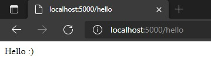
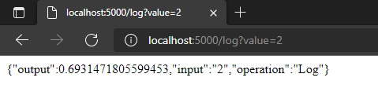
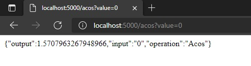
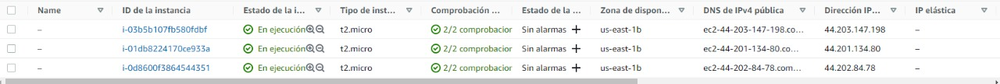
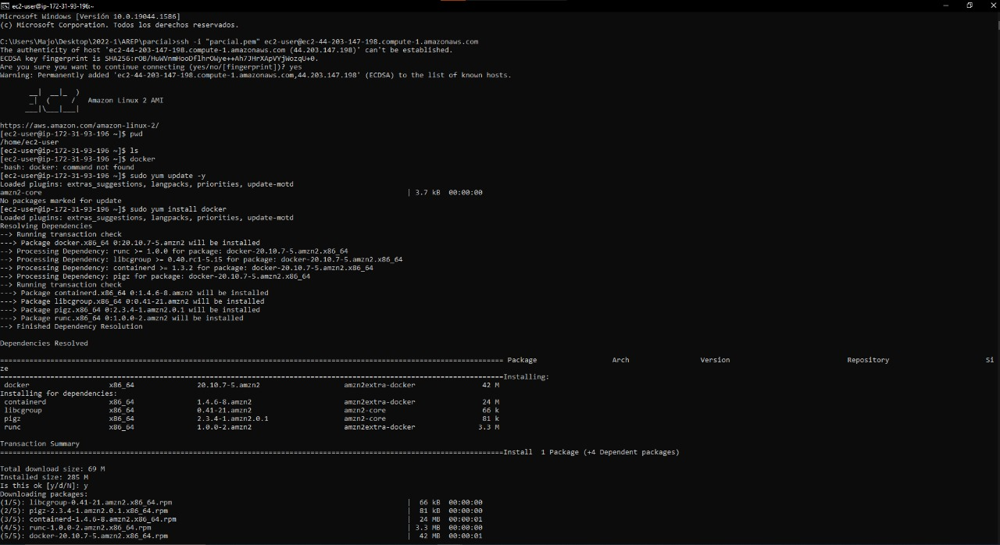
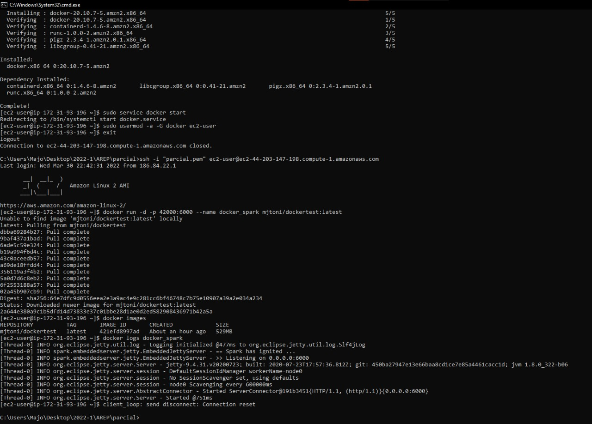
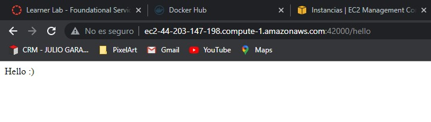
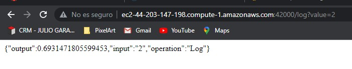
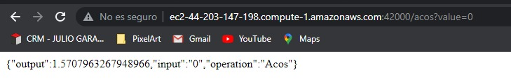

# Parcial AREP Tercio 2
## María José Torres Nieves
### CC 1000319405
Las funciones seleccionadas fueron:
* Log
* Acos
## Funcionamiento local
* /hello



* /log



* /acos



## Funcionamiento AWS
* Creación maquinas EC2



* Configuración imagenes docker




* Evidencia funcionamiento 




## Explicación EC2

Primero se deben crear las instancias de EC2 y nos conectamos con un ssh client.
A cada máquina se le debe descargar docker con el siguiente comando 
```
	sudo yum install docker
```
Iniciamos el servicio con este comando
```
    sudo service docker start
```
Y corremos la imagen del repositorio en Docker con el codigo de Spark.
```
    docker run -d -p 42000:6000 --name
```
Una vez ejecutado el entorno ingresamos al DNS público y realizamos las pruebas que vieron con anterioridad.

## Prueba video
<video src="evidencia/videofuncionamiento.mp4" width="540" height="480"></video>

Tambien puede encontrar el video en la carpeta evidencia.